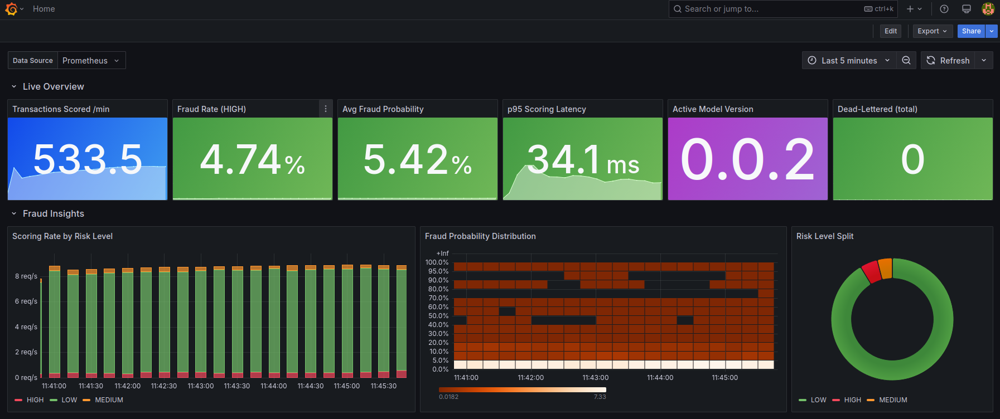
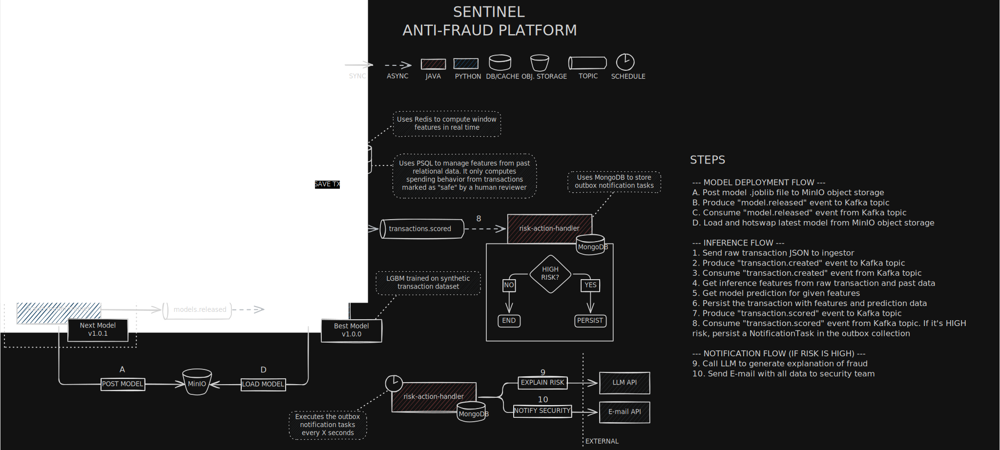
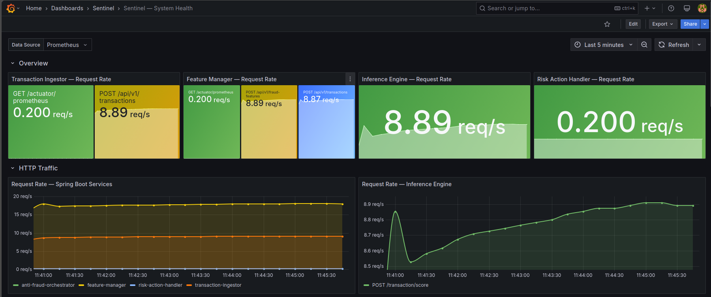

# Sentinel

Real-time fraud detection platform that combines event-driven microservice architecture with machine learning inference to score financial transactions as they happen.

The system ingests raw transactions, enriches them with behavioral features, runs them through a calibrated LightGBM model, and takes automated risk-based actions, all within a single Kafka-driven pipeline.



---

## Table of Contents

- [Why This Project](#why-this-project)
- [System Architecture](#system-architecture)
- [Services](#services)
  - [Transaction Ingestor](#transaction-ingestor)
  - [Anti-Fraud Orchestrator](#anti-fraud-orchestrator)
  - [Feature Manager](#feature-manager)
  - [Fraud Inference Engine](#fraud-inference-engine)
  - [Risk Action Handler](#risk-action-handler)
- [Security](#security)
- [Resilience & Error Handling](#resilience--error-handling)
- [ML Pipeline](#ml-pipeline)
  - [Training Pipeline](#training-pipeline)
  - [Feature Engineering](#feature-engineering)
  - [Model Lifecycle](#model-lifecycle)
- [Infrastructure](#infrastructure)
- [Observability & Dashboards](#observability--dashboards)
- [API Documentation](#api-documentation)
- [Getting Started](#getting-started)
- [Architecture Diagram](#architecture-diagram)

---

## Why This Project

Sentinel exists at the intersection of two disciplines:

- **Backend System Design** — Event-driven microservices communicating over Kafka, with PostgreSQL, Redis, and MongoDB handling different persistence needs. Circuit breakers, idempotent producers, transactional outbox patterns, and multi-layer caching are built into the pipeline.

- **Machine Learning Engineering** — A full ML lifecycle from synthetic dataset generation through hyperparameter tuning, isotonic calibration, and SHAP-based explainability, deployed as a real-time inference API with hot-swappable model versioning.

The goal is not just to detect fraud, but to demonstrate how ML models integrate into production-grade distributed systems with proper feature contracts, model versioning, observability, and automated decision-making.

---

## System Architecture

Sentinel is composed of five microservices connected by Apache Kafka topics. Each service owns a single responsibility and communicates asynchronously through events:



**Data flow:**
1. A transaction arrives via REST at the **Transaction Ingestor** and is published to Kafka
2. The **Anti-Fraud Orchestrator** consumes the event and coordinates the scoring pipeline
3. The **Feature Manager** computes 25 features from PostgreSQL, Redis, and derived calculations
4. The **Fraud Inference Engine** scores the feature vector using a calibrated LightGBM model and returns SHAP explanations
5. The scored transaction is published to Kafka for downstream consumers
6. The **Risk Action Handler** persists the result, generates an LLM-powered explanation, and sends email alerts for high-risk transactions

Internal synchronous calls (Orchestrator → Feature Manager / Inference Engine) are authenticated with short-lived **RS256 JWTs** (see [Security](#security)). Kafka consumers retry with exponential backoff and route poison messages to **dead-letter topics** (see [Resilience & Error Handling](#resilience--error-handling)).

---

## Services

### Transaction Ingestor

**Reactive REST entrypoint** for external transaction submission.

| Aspect | Detail |
|---|---|
| Stack | Java 26, Spring Boot 4, WebFlux |
| Port | `8080` |
| Kafka Topic | Produces to `transactions.created` |
| Features | Idempotent Kafka producer (`acks=all`), request validation, OpenAPI docs |

### Anti-Fraud Orchestrator

**Pipeline coordinator** that consumes raw transaction events and orchestrates the end-to-end scoring flow through synchronous HTTP calls to Feature Manager and Fraud Inference Engine.

| Aspect | Detail |
|---|---|
| Stack | Java 26, Spring Boot 4, Spring Kafka, RestClient |
| Port | `8081` |
| Kafka Topics | Consumes `transactions.created` (dead-letters to `transactions.created.DLT`), produces `transactions.scored` |
| Features | Resilience4j circuit breakers, idempotent Kafka producer, consumer retries with exponential backoff + dead-letter routing, feature-to-inference field mapping (`@JsonProperty` camelCase to snake_case) |
| Auth | Mints short-lived RS256 service JWTs for downstream calls; publishes public keys at `GET /.well-known/jwks.json` |

### Feature Manager

**Real-time feature computation engine** that builds the 25-dimensional feature vector for each transaction.

| Aspect | Detail |
|---|---|
| Stack | Java 26, Spring Boot 4, Spring Data JPA, Spring Data Redis |
| Port | `8082` |
| Persistence | PostgreSQL (entity data + feature vectors), Redis (velocity windows) |
| Features | Flyway migrations, Caffeine L1 cache + Redis L2 cache, velocity calculations (5-min/1-hour windows), IP risk scoring, cold-start defaults |
| Auth | JWT-protected endpoints (OAuth2 resource server validating the orchestrator's RS256 tokens via JWKS) |

**Computed features include:**

| Category | Features |
|---|---|
| Base transaction | `amount`, `amountToAverageRatio`, `hourOfDay`, `dayOfWeek` |
| User behavior | `userAverageAmount`, `userHistoricalTransactionCount`, `userAccountAgeDays` |
| Velocity | `userTransactionCount5Min`, `userTransactionCount1Hour`, `amountVelocity1Hour`, `distinctMerchantCount1Hour` |
| Risk signals | `merchantRiskScore`, `ipRiskScore`, `isDeviceTrusted`, `hasCountryMismatch`, `cardAgeDays` |
| Engineered (log) | `logAmount`, `logSecondsSinceLastTransaction`, `logVelocity1Hour` |
| Engineered (interaction) | `amountTimesMerchantRisk`, `riskScoreProduct`, `ipDeviceRisk`, `countryIpRisk`, `velocityAmountInteraction`, `recencyVelocity` |
| Engineered (derived) | `amountDeviation`, `isNight`, `velocityIntensity` |

### Fraud Inference Engine

**ML model serving API** that scores transactions and provides SHAP-based explainability.

| Aspect | Detail |
|---|---|
| Stack | Python 3.12, FastAPI, LightGBM, SHAP, scikit-learn |
| Port | `8083` |
| Model | LightGBM binary classifier with isotonic calibration |
| Features | Feature contract validation at startup, 99th-percentile feature capping, SHAP TreeExplainer for top-k feature contributions, model hot-swap via Kafka (`models.released` topic), MinIO model storage |
| Auth | JWT-protected scoring endpoint (verifies the orchestrator's RS256 tokens via JWKS using PyJWT) |

**Scoring response example:**
```json
{
  "transaction_id": "tx-001",
  "fraud_probability": 0.8721,
  "risk_level": "HIGH",
  "model_version": "v3",
  "explainability": {
    "top_contributing_features": [
      {
        "feature_name": "amount_deviation",
        "feature_value": 45.2,
        "contribution": 0.342,
        "direction": "INCREASED_FRAUD_RISK"
      }
    ]
  }
}
```

### Risk Action Handler

**Decision and notification service** that reacts to scored transactions.

| Aspect | Detail |
|---|---|
| Stack | Java 26, Spring Boot 4, Spring Data MongoDB, Spring Mail |
| Port | `8084` |
| Kafka Topics | Consumes `transactions.scored` (dead-letters to `transactions.scored.DLT`) |
| Persistence | MongoDB (notification outbox) |
| Features | LLM-powered alert generation (Groq/Llama 3.1), SMTP email notifications, consumer retries with exponential backoff + dead-letter routing, transactional outbox pattern with step-based retries (exponential backoff, max 5 attempts), batch polling |

---

## Security

Internal synchronous HTTP calls are authenticated with **RS256 JSON Web Tokens** using a self-contained JWKS flow — no external authorization server required.

- **Issuer** — The Anti-Fraud Orchestrator generates an RSA key pair **in memory at startup**, signs short-lived service tokens (`iss`/`aud`/`exp`), and exposes the public keys at `GET /.well-known/jwks.json`.
- **Verifiers** — The Feature Manager (Spring OAuth2 resource server) and Fraud Inference Engine (FastAPI + PyJWT) fetch the orchestrator's public key from the JWKS endpoint and validate each token's signature, issuer, and audience. Unauthenticated requests are rejected with `401`.
- **Key handling** — Keys are ephemeral and rotate on every orchestrator restart; verifiers refresh the JWKS automatically, so no key files or volumes are needed.

Kafka transport and the public transaction-ingestion endpoint are outside this internal-auth boundary.

| Variable | Description | Default |
|---|---|---|
| `JWKS_URI` | JWKS endpoint the verifiers fetch public keys from | `http://anti-fraud-orchestrator:8081/.well-known/jwks.json` |
| `SERVICE_AUTH_ISSUER` | Expected token issuer | `anti-fraud-orchestrator` |
| `SERVICE_AUTH_AUDIENCE` | Expected token audience | `sentinel-internal` |
| `SERVICE_AUTH_TOKEN_TTL_SECONDS` | Lifetime of minted tokens (orchestrator) | `60` |

---

## Resilience & Error Handling

Sentinel is built to degrade gracefully and avoid silently dropping events:

- **Idempotent producers** — Kafka producers run with `acks=all` and idempotence enabled to prevent duplicate events.
- **Circuit breakers** — Resilience4j guards the orchestrator's synchronous calls to the Feature Manager and Inference Engine.
- **Consumer retries + dead-letter topics** — Kafka listeners retry failed messages with exponential backoff and, once attempts are exhausted, publish the poison message to a dedicated dead-letter topic. Validation errors are treated as non-retryable and dead-lettered immediately.
  - Anti-Fraud Orchestrator: `transactions.created` → `transactions.created.DLT`
  - Risk Action Handler: `transactions.scored` → `transactions.scored.DLT`
- **Transactional outbox** — The Risk Action Handler persists notification work to MongoDB and processes it with step-based retries (exponential backoff, max 5 attempts) before marking a task as dead-lettered, ensuring at-least-once email delivery.

---

## ML Pipeline

### Training Pipeline

The `fraud-model-trainer/` directory contains the complete offline ML pipeline:

```
Dataset Generation ──> Feature Engineering ──> Optuna Tuning ──> Training ──> Calibration ──> Evaluation ──> Upload
```

| Step | Tool | Description |
|---|---|---|
| Dataset generation | `dataset_generator.py` | Generates realistic synthetic transaction data with configurable fraud scenarios (account takeover, card testing, velocity burst, stealth fraud, etc.) across 5 user segments |
| Training | `training_pipeline.py` | LightGBM training with Optuna hyperparameter search, isotonic calibration, F-beta threshold optimization |
| Model upload | `upload_model.py` | Uploads model bundle to MinIO and publishes a `models.released` Kafka event for live hot-swap |

**Usage:**
```bash
# Generate training data
python dataset_generator.py 500000 --seed 42 --output data/transactions.csv

# Train with Optuna hyperparameter search
python training_pipeline.py data/transactions.csv models v4 --beta 2.0 --n-trials 50

# Deploy model to inference engine (hot-swap)
python upload_model.py models/lgbm_v4.joblib
```

### Feature Engineering

Features are engineered both at training time (in `training_pipeline.py`) and at serving time (in `feature-manager`), maintaining a strict feature contract between the two.

**Approach:**
- **Log transforms** on skewed distributions (`log1p` on amount, time since last transaction, hourly velocity)
- **Interaction features** that combine risk signals (e.g., `ipRiskScore * (1 - isDeviceTrusted)`)
- **99th-percentile capping** on outlier-prone interactions (`amountTimesMerchantRisk`, `velocityAmountInteraction`), computed at training time and stored in the model bundle for consistent application during inference
- **Categorical encoding** for merchant category and card type (label encoding)

**Feature contract enforcement:**
The inference engine validates at startup that every feature the model expects can be provided by the request schema. This prevents silent drift between the feature computation layer (Java) and the model serving layer (Python).

### Model Lifecycle

```
Train locally ──> Save .joblib bundle ──> Upload to MinIO ──> Kafka event ──> Inference Engine hot-swaps
```

The model bundle (`.joblib`) packages:
- Trained LightGBM classifier
- Isotonic calibrator (probability refinement)
- Optimal decision threshold (F-beta optimized)
- Feature name list (contract enforcement)
- Feature caps (99th-percentile clipping values)
- Training metrics and hyperparameters

The inference engine listens on the `models.released` Kafka topic. When a new model is uploaded to MinIO, a Kafka event triggers the engine to download and swap the model in-memory with zero downtime.

---

## Infrastructure

All services are containerized and orchestrated with Docker Compose.

| Component | Purpose |
|---|---|
| **Apache Kafka** | Event backbone (`transactions.created`, `transactions.scored`, `models.released`) plus dead-letter topics (`transactions.created.DLT`, `transactions.scored.DLT`) |
| **PostgreSQL 16** | Relational storage for users, merchants, cards, transactions, feature vectors, and predictions |
| **Redis 7** | Velocity window tracking (5-min / 1-hour transaction counts and amounts) |
| **MongoDB 7** | Notification outbox for resilient email delivery |
| **MinIO** | S3-compatible object storage for ML model bundles |
| **Prometheus** | Metrics collection from all 5 services, including custom fraud/business metrics (Spring Micrometer + FastAPI / prometheus_client) |
| **Grafana** | Two pre-provisioned dashboards: **Fraud Detection Overview** (home — fraud rate, score distribution, risk breakdown, pipeline flow) and **System Health** (HTTP/JVM/Kafka ops metrics) |
| **Kafka UI** | Web interface for topic inspection and message browsing |

---

## Observability & Dashboards

Every service exports Prometheus metrics — Spring Micrometer for the JVM services and `prometheus_client` for the FastAPI inference engine. Prometheus scrapes them on a 15s interval, and Grafana ships with two dashboards auto-provisioned from `monitoring/grafana/dashboards/`.

| Dashboard | UID | Answers |
|---|---|---|
| **Fraud Detection Overview** (home) | `sentinel-fraud-overview` | *Is the fraud pipeline working and what is it catching?* — business and ML-serving metrics |
| **System Health** | `sentinel-traffic` | *Are the services healthy?* — HTTP, Kafka, and JVM operational metrics |

**Fraud Detection Overview** — the hero image above. Key panels:
- Live KPIs: transactions scored/min, HIGH-risk fraud rate, average fraud probability, p95 scoring latency, active model version, dead-letter totals
- Scoring rate by risk level (LOW / MEDIUM / HIGH) and fraud-probability distribution heatmap
- Pipeline flow: ingested vs. scored vs. alerted throughput, Kafka consumer lag, dead-letter rate by topic
- ML serving: inference latency percentiles (p50/p95/p99), feature cache hit ratio, notification outbox by status

**System Health** — the operational view. Key panels:
- Per-service HTTP request rate, average response time, and 5xx error rate
- Status-code breakdowns and p95 / p99 latency percentiles for the Spring Boot services
- Kafka consumer record rate and lag per topic
- JVM heap, thread count, and GC pause rate



Both dashboards are reachable at `http://localhost:3000` (admin / admin) once the stack is up. Drive traffic with `scripts/traffic_generator.py` (see [Getting Started](#getting-started)) to populate them.

---

## API Documentation

Every service that exposes HTTP endpoints ships interactive **OpenAPI / Swagger** documentation with annotated schemas, request/response examples, and documented error responses. Examples in the docs are aligned with the Flyway seed data and the feature-computation formulas.

| Service | Docs URL | Notes |
|---|---|---|
| Transaction Ingestor | `http://localhost:8080/swagger-ui.html` | Public `POST /api/v1/transactions` |
| Anti-Fraud Orchestrator | `http://localhost:8081/swagger-ui.html` | JWKS endpoint |
| Feature Manager | `http://localhost:8082/swagger-ui.html` | JWT-protected (use the **Authorize** button) |
| Fraud Inference Engine | `http://localhost:8083/docs` | JWT-protected (use the **Authorize** button) |

The Risk Action Handler is event-driven (Kafka consumer) and exposes no public HTTP API. Raw OpenAPI specs are available at `/v3/api-docs` (Spring services) and `/openapi.json` (inference engine).

---

## Getting Started

### Prerequisites

- Docker and Docker Compose
- Java 26 (for local development of Java services)
- Python 3.12 (for the inference engine and training pipeline)

### Running the Full Stack

```bash
# Start all services and infrastructure
docker compose up --build

# Or start just the infrastructure (Kafka, Postgres, Redis, MongoDB, MinIO)
docker compose up kafka kafka-init postgres redis mongodb minio minio-init
```

### Service Endpoints

| Service | URL |
|---|---|
| Transaction Ingestor (API) | `http://localhost:8080` |
| Anti-Fraud Orchestrator | `http://localhost:8081` |
| Feature Manager | `http://localhost:8082` |
| Fraud Inference Engine | `http://localhost:8083` |
| Risk Action Handler | `http://localhost:8084` |
| Kafka UI | `http://localhost:8090` |
| Prometheus | `http://localhost:9090` |
| Grafana | `http://localhost:3000` (admin/admin) |
| MinIO Console | `http://localhost:9001` (minioadmin/minioadmin) |

### Generating Live Traffic

Once the stack is up (with a model loaded), drive synthetic transactions so the dashboards come alive. The generator uses seed-aligned IDs and only the Python standard library:

```bash
# ~10 transactions/sec for 5 minutes, 1% fraud-like
python scripts/traffic_generator.py --rate 10 --duration 300 --fraud-ratio 0.01
```

Then open Grafana at `http://localhost:3000` — the **Fraud Detection Overview** dashboard is the default home page.

> The hero image above lives at `docs/business-dashboard.png`. To refresh it, run the traffic generator and capture a screenshot of the Fraud Detection Overview dashboard.

### Training a Model

```bash
cd fraud-model-trainer
pip install -r requirements.txt

# Generate synthetic dataset
python dataset_generator.py 500000 --seed 42 --output data/transactions.csv

# Train model with hyperparameter tuning
python training_pipeline.py data/transactions.csv models v1 --beta 2.0 --n-trials 50

# Upload to MinIO and trigger hot-swap
python upload_model.py models/lgbm_v1.joblib
```

### Environment Variables

The Risk Action Handler requires the following environment variables for full functionality:

| Variable | Description |
|---|---|
| `GROQ_API_KEY` | API key for LLM-powered fraud explanations |
| `EMAIL_HOST` | SMTP server hostname |
| `EMAIL_PORT` | SMTP server port |
| `EMAIL_USERNAME` | SMTP authentication username |
| `EMAIL_PASSWORD` | SMTP authentication password |
| `DESTINATION_EMAIL` | Recipient for fraud alert emails |
